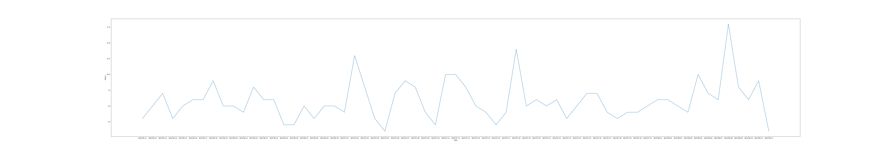
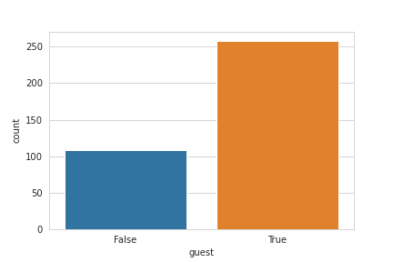
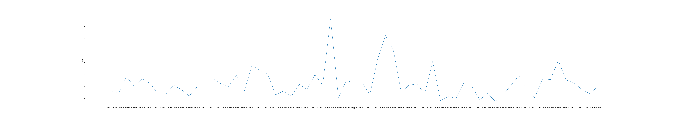

# Behamics Trial Kickstart
Task implemented in Jupyter Notebook using conda environment.

### Tools:
- Pymongo
- NumPy
- Pandas
- SeaBorn

## Tasks:

###  1.Total orders daily
    1.  Perform the calculation in aggregate query.
    2.  Perform the calculation in python.
    3.  Which one is faster.
    4.  Plot the line plot on seaborn.

***Output:***

 ### 2.Did the user purchase more as guest or logged in?**
    1.  Plot the results.
 
 ***Output:***
 
 
### 3.Find top 10% of purchased products according to productID.
    
 ### 4.Find daily Average Order Value (AOV).
    1.  Perform the calculation in aggregate query.
    2.  Perform the calculation in python.
    3.  Which one is faster.
    4.  Plot the line plot on seaborn.

***Output:***

